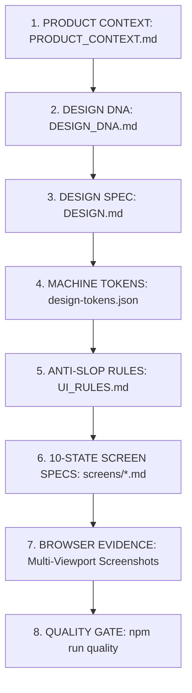

# AI UI Design Governance Constitution for Autonomous Coding Agents

> **Core Philosophy:** *AI coding agents are free to generate user interfaces rapidly, but are strictly prohibited from degrading design system discipline, aesthetic elegance, or user accessibility with generic "AI Slop".*

This document serves as the **Single Source of Truth (SSOT)** and **Development Constitution** for all AI Coding Agents (including OpenAI Codex, Claude Code, Cursor, GitHub Copilot, Gemini, and Windsurf) operating within this repository.

---

## 1. The 6-Layer Anti-Slop Architecture

---

## 2. Strictly Banned Patterns (Negative Constraints)

- ❌ **No Purple/Blue Gradient Clichés**: Never apply `linear-gradient` hero fills or marketing gradients.
- ❌ **No Gradient Text**: Never render headings with gradient fills (`-webkit-text-fill-color: transparent`).
- ❌ **No Glowing Neon Shadows**: Never apply glowing colored box-shadows. Use crisp 1px borders (`#334155`) for delineation.
- ❌ **No "Card Soup"**: Do not wrap every arbitrary element in a rounded card. Never nest cards deeper than 1 level.
- ❌ **No Pill Buttons Everywhere**: Standard actions must use calibrated `radius-md` (6px) controls, never full-pill `rounded-full`.
- ❌ **No Marketing Hero in Tools**: Productivity and operational consoles must prioritize immediate data density and workflows over 80px marketing banners.
- ❌ **No Fake Vanity KPIs**: Do not invent arbitrary metric tiles with meaningless sparklines unless tied to real domain data.
- ❌ **No Excessive Whitespace**: Never inject arbitrary 64px+ spacing in dense professional workbench software.

---

## 3. Mandatory Positive Principles

- ✅ **Spec-First Engineering**: Read or create `design/screens/<screen>.md` before writing UI code.
- ✅ **Design Tokens Compliance**: All colors, radiuses, paddings, and font sizes must reference `design/design-tokens.json` (zero hardcoded arbitrary pixel values).
- ✅ **Clinical Precision Archetype**: Follow the structural, high-density, monochrome foundation specified in `DESIGN_DNA.md`.
- ✅ **10-State Screen Completeness**: Every screen and interactive workflow must specify and account for the 10 states:
  1. Default, 2. Loading, 3. Empty, 4. Error, 5. Success, 6. Disabled, 7. Unauthorized, 8. Offline, 9. Overflow, 10. Large Dataset.
- ✅ **Evidence-Based Browser Verification**: Never trust code alone. Run `npm run ui:screenshot` to capture and inspect real multi-viewport renderings (Desktop 1440x900, Tablet 768x1024, Mobile 375x812).

---

## 4. Definition of Done (DoD) Checklist

A UI task or page is **strictly incomplete** if any of the following items are unresolved:

- [ ] **Spec Compliance:** A verified `screens/<screen-name>.md` exists with purpose, layout, and 10 states.
- [ ] **Design Token Conformance:** 100% of colors, radiuses, paddings, and font sizes reference `design-tokens.json` (`npm run ui:tokens`).
- [ ] **Anti-Slop Linter Pass:** Zero prohibited patterns reported by `npm run ui:lint`.
- [ ] **Multi-Viewport Evidence:** Screenshots rendered and saved in `screenshots/desktop/`, `screenshots/tablet/`, and `screenshots/mobile/`.
- [ ] **Mandatory State Coverage:** Verified default, loading, empty, and error states rendered and visually coherent.
- [ ] **Accessibility (WCAG 2.1 AA):** Color contrast >= 4.5:1, visible keyboard focus rings, semantic markup.
- [ ] **Zero Layout Overflow:** Long strings, emails, table cells, and numerical values wrap or truncate with ellipsis without breaking page layout.
- [ ] **Unified Quality Gate:** `npm run quality` passes all verifications cleanly.
