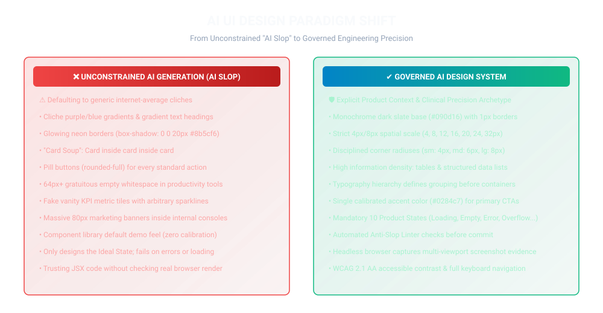
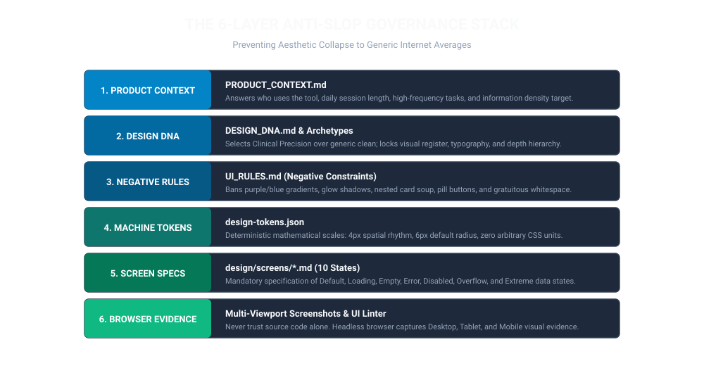
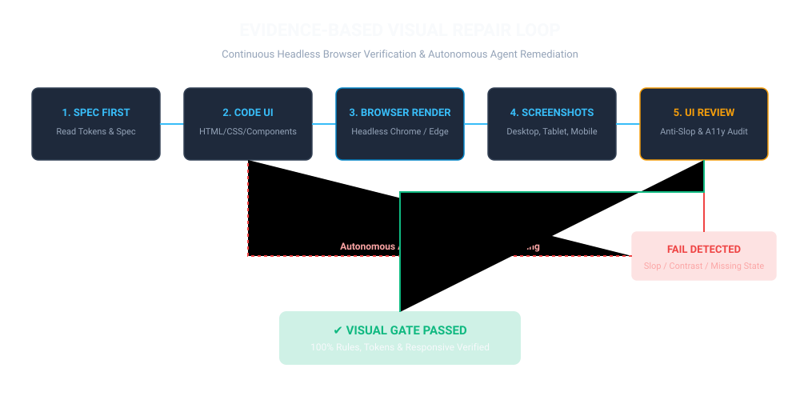
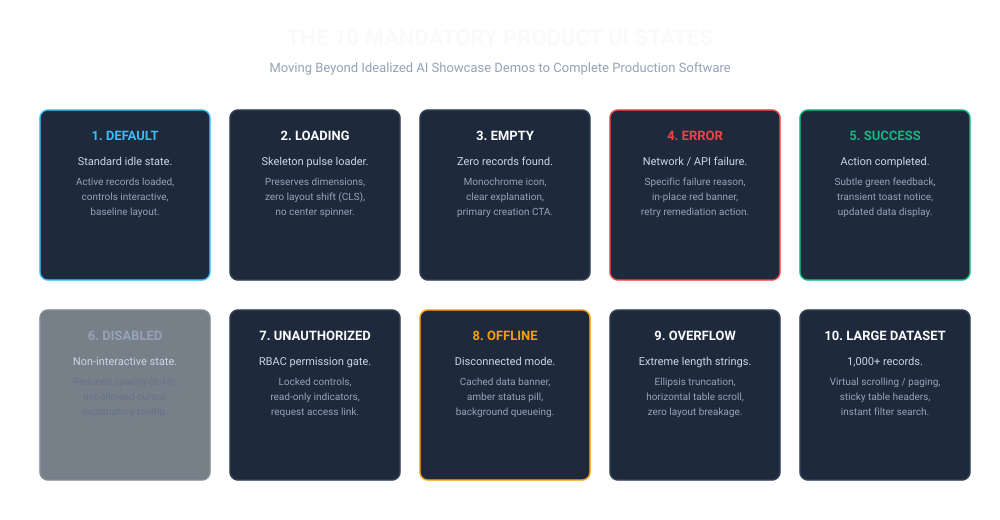
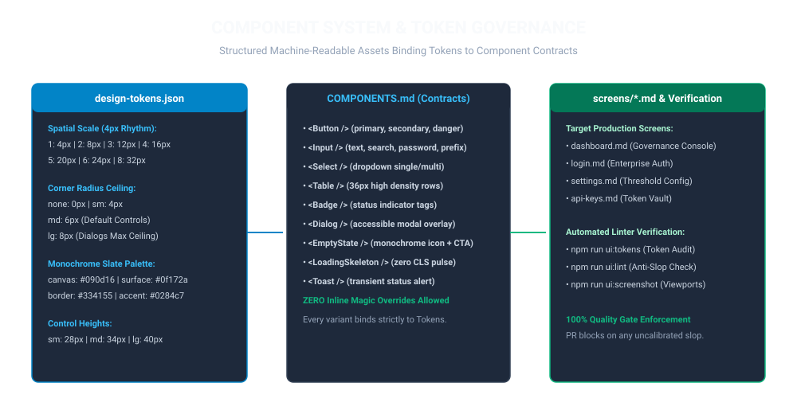

# AI UI Design Governance: Anti-Slop System & Autonomous Verification

[](scripts/verify-fix-loop.mjs)
[](UI_RULES.md)
[](design/design-tokens.json)
[](DESIGN_DNA.md)
[](LICENSE)
[](README.zh-CN.md)

> **Universal Engineering Constitution & Autonomous Quality Pipeline:** Eliminate generic "AI Slop" (gratuitous gradients, glowing borders, nested card soup, low information density) from AI-generated frontends by enforcing explicit Product Context, Design DNA, Strict Tokens, 10-State Screen Specs, and Headless Browser Verification.

---

## 1. AI UI Design Paradigm Shift

When AI agents design frontends without deterministic constraints, they inevitably converge to internet averages: purple/blue gradients, glowing cards, and empty marketing whitespace inside internal tools.

This framework replaces unconstrained generation with **Governed UI Engineering**:



---

## 2. The 6-Layer Anti-Slop Governance Stack

The antidote to AI Slop is not a prompt—it is **converting product context, design personality, spatial tokens, screen specifications, and headless browser evidence into permanent repository assets.**



---

## 3. Evidence-Based Visual Repair Loop

Never trust source code or JSX as visual evidence. A build pass only proves technical syntax—it does not prove usability, contrast, or responsiveness.

Every UI modification triggers an autonomous verification cycle:



1. **Spec-First:** Agent ingests `PRODUCT_CONTEXT.md`, `DESIGN_DNA.md`, and `screens/<name>.md`.
2. **Implementation:** Generates code adhering strictly to `design/design-tokens.json`.
3. **Browser Render:** Launches headless Chrome/Edge against the live page.
4. **Screenshot Capture:** Captures high-fidelity snapshots at Desktop (1440x900), Tablet (768x1024), and Mobile (375x812).
5. **Multi-Dimensional Review:** Audits anti-slop rules, WCAG 2.1 AA contrast, and state completeness.
6. **Autonomous Repair:** If any check fails, the agent diagnoses root causes and refactors until 100% green.

---

## 4. The 10 Mandatory Product UI States

AI prototypes notoriously design only the *Ideal State* (data present, no errors). Professional software requires 10 distinct operational states:



| State | Engineering & Visual Contract |
| :--- | :--- |
| **1. Default** | Steady-state view with live records, full interactivity, and baseline spatial rhythm. |
| **2. Loading** | Structured skeleton pulse loaders matching destination geometry (zero CLS, no generic center spinners). |
| **3. Empty** | Zero records found. Monochrome geometric icon, actionable explanation, and creation CTA. |
| **4. Error** | Network/API failure. Descriptive diagnostic banner in-place with retry remediation. |
| **5. Success** | Action confirmed. Transient toast notice, updated data table, subtle emerald feedback. |
| **6. Disabled** | Non-interactive. Reduced opacity (0.45), `not-allowed` cursor, explanatory tooltip. |
| **7. Unauthorized** | RBAC permission gate. Locked controls, read-only indicators, access request trigger. |
| **8. Offline** | Disconnected mode. Local cache indicator banner, background sync queue. |
| **9. Overflow** | Extreme long strings (64+ chars). Clean ellipsis truncation without breaking grid layout. |
| **10. Large Dataset**| 1,000+ records. Virtual scrolling / compact pagination, sticky table headers, instant search filter. |

---

## 5. Component System & Token Governance

Standardized controls are locked to machine-readable design tokens, preventing arbitrary CSS injection and drift across pages:



---

## 6. Repository Structure

```text
ai-ui-design-governance/
├── AGENTS.md                                   # Master UI Design Governance Constitution
├── UI_DESIGN_GOVERNANCE_IMPLEMENTATION_SPEC.md# Step-by-step agent implementation runbook
├── PRODUCT_CONTEXT.md                          # Product positioning, personas, density profile
├── DESIGN_DNA.md                               # Clinical Precision archetype & visual register
├── DESIGN.md                                   # Complete visual design specification
├── UI_RULES.md                                 # Anti-Slop negative constraints & positive rules
├── UI_REVIEW.md                                # 6-dimensional review & acceptance criteria
│
├── design/
│   ├── design-tokens.json                      # Machine-readable tokens (colors, space, radius)
│   ├── COMPONENTS.md                           # Inventory of 13+ standardized core components
│   ├── screens/                                # 10-state screen specifications
│   │   ├── dashboard.md                        # Primary developer dashboard spec
│   │   ├── login.md                            # Enterprise SSO & auth spec
│   │   ├── settings.md                         # Policy & threshold configuration spec
│   │   └── api-keys.md                         # Agent credential & vault spec
│   └── references/
│       └── design-archetypes.md                # Reference archetypes catalog
│
├── screenshots/                                # Real headless browser visual evidence
│   ├── desktop/dashboard-1440x900.png          # Desktop viewport capture
│   ├── tablet/dashboard-768x1024.png           # Tablet viewport capture
│   └── mobile/dashboard-375x812.png            # Mobile viewport capture
│
├── scripts/
│   ├── verify-fix-loop.mjs                     # Unified UI quality gate runner
│   ├── ui-review.mjs                           # Automated anti-slop & state completeness linter
│   ├── design-token-check.mjs                  # Design token schema & boundary checker
│   ├── screenshot.mjs                          # Headless browser multi-viewport capture
│   └── generate-ui-diagrams.mjs                # High-definition SVG diagram generator
│
├── src/presentation/ui/
│   └── pilot-dashboard.html                    # Accessible, token-compliant pilot dashboard
│
└── tests/governance/
    └── DesignGovernance.test.mjs               # Design governance test suite
```

---

## 7. CLI Commands & Quick Start

```bash
# 1. Install dependencies
npm install

# 2. Execute unified UI design quality gate
npm run quality

# 3. Audit design tokens & spatial boundaries
npm run ui:tokens

# 4. Scan UI files & screen specs for AI Slop violations
npm run ui:lint

# 5. Capture real headless browser screenshots across viewports
npm run ui:screenshot

# 6. Re-generate all high-definition SVG diagrams
npm run generate:diagrams

# 7. Run design governance tests
npm test
```
