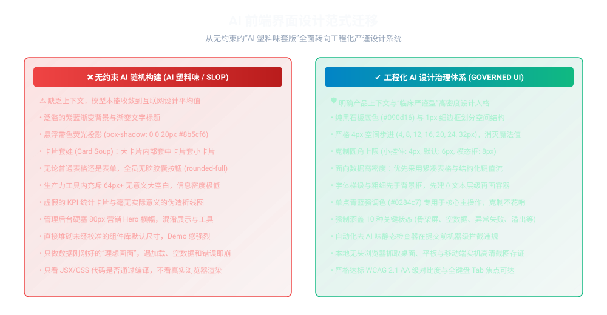
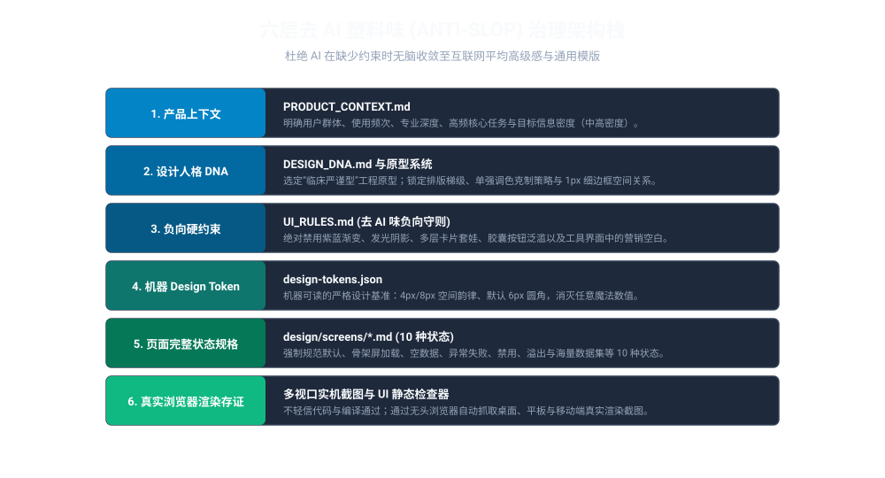
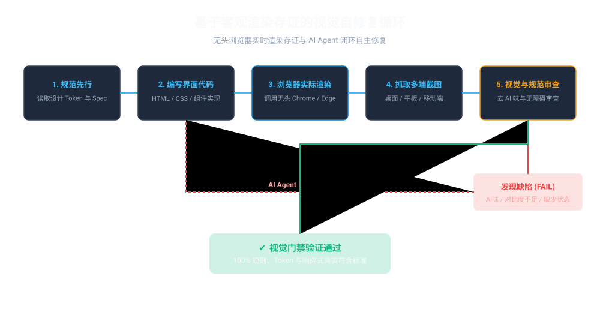
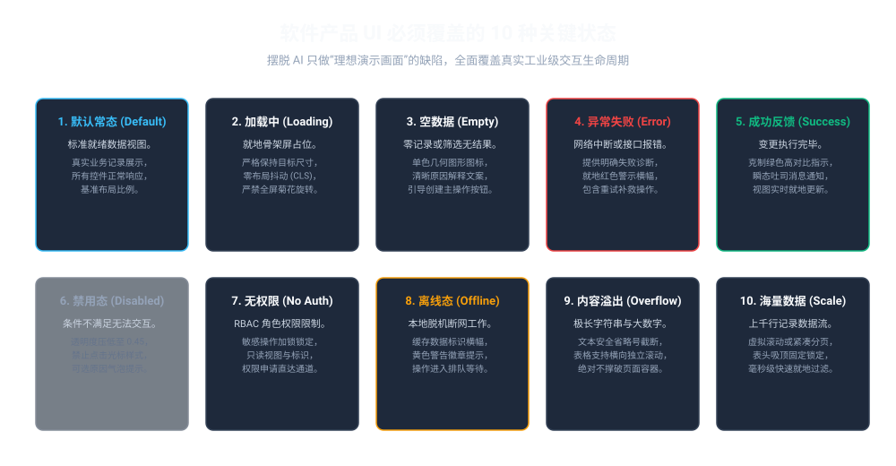
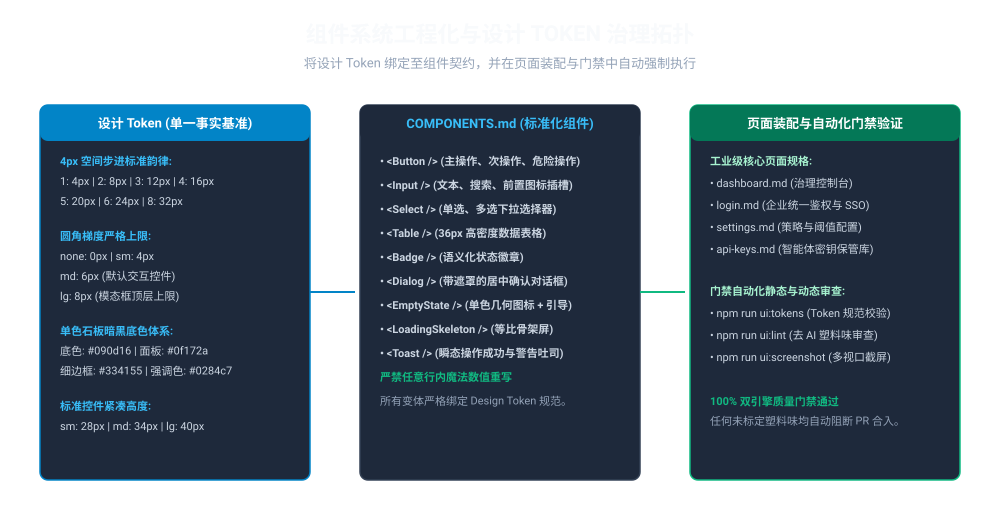

# AI UI Design Governance: 去 AI 塑料味前端设计工程治理框架

[](scripts/verify-fix-loop.mjs)
[](UI_RULES.md)
[](design/design-tokens.json)
[](DESIGN_DNA.md)
[](LICENSE)
[](README.md)

> **AI 前端设计开发宪法与自主闭环质量门禁体系：** 彻底杜绝 AI 生成界面中的“塑料味”（紫蓝渐变、发光边缘、卡片套娃、低信息密度），通过产品上下文、设计人格（Design DNA）、机器 Token、10 种页面状态规格与无头浏览器实机渲染存证，建立专业成熟的工业级前端界面。

---

## 1. AI 前端界面设计范式迁移

当 AI Agent 在缺乏工程约束下编写前端页面时，往往本能收敛至互联网设计平均值：紫蓝渐变、带色发光阴影与卡片套娃。

本项目通过工程化设计规范彻底终结无约束随意生成：



---

## 2. 六层去 AI 塑料味治理架构栈

去除 AI 味的核心不是写一段更长、更华丽的提示词，而是**将产品理解、设计人格 (Design DNA)、设计 Token、10 种关键页面状态以及真实的无头浏览器实机渲染存证，沉淀为项目内长期的确定性工程资产**。



---

## 3. 基于客观浏览器渲染存证的自修复循环

**绝对不要将源代码（JSX/HTML/CSS）当做视觉验收依据。** 编译通过（Build PASS）仅代表语法和技术层面可行，根本不能证明界面在实际屏幕上清晰好用、没有溢出、没有对比度缺陷。

所有 UI 界面的生成和修改，均必须触发自主闭环验证链路：



1. **规范先行 (Spec-First)：** Agent 必须先阅读 `PRODUCT_CONTEXT.md`、`DESIGN_DNA.md` 与当前页面的规格文档 `screens/<name>.md`。
2. **代码实现：** 严格遵循 `design/design-tokens.json` 中的间距、色板与圆角基准编写组件与样式。
3. **浏览器真实渲染：** 启动本地无头 Chrome / Edge 渲染目标页面。
4. **多端实机抓图：** 自动截取桌面端 (1440x900)、平板端 (768x1024) 和移动端 (375x812) 真实渲染图存证于 `screenshots/`。
5. **多维质量审查：** 执行 `npm run ui:lint` 自动扫描是否含有禁用的紫蓝渐变、发光阴影、胶囊按钮或缺少关键状态。
6. **自主定位与修复：** 若发现任何瑕疵，Agent 自主分析根因并重构修复代码，重新渲染验证，直到 100% 绿灯。

---

## 4. 软件产品必须具备的 10 种关键状态

AI 演示原型最容易犯的错误是只做“理想常态”（数据刚好、没有错误）。工业级生产力软件必须完整定义并实现 10 种交互状态：



| 状态类型 | 视觉表现与工程契约 |
| :--- | :--- |
| **1. 默认常态 (Default)** | 标准就绪状态。加载真实生产数据，所有交互控件正常可用，基准空间排版。 |
| **2. 骨架屏加载 (Loading)** | 严格维持目标元素几何尺寸的骨架屏占位（杜绝累积布局偏移 CLS，严禁全屏旋转菊花）。 |
| **3. 空数据 (Empty)** | 零记录或过滤无果。展示单色线框几何图标、明确的原因解释文案与新建引导主按钮。 |
| **4. 异常失败 (Error)** | 接口超时或鉴权失败。就地红色警示条，给出明确技术诊断原因与重试补救操作。 |
| **5. 成功反馈 (Success)** | 操作完成确认。瞬态吐司消息通知、视图数据就地更新、克制的高对比度绿色指示。 |
| **6. 禁用态 (Disabled)** | 业务条件不满足。透明度压低至 0.45、禁止点击光标样式 (`not-allowed`)，带提示解释气泡。 |
| **7. 无权限 (Unauthorized)** | RBAC 角色限制。敏感操作按钮加锁变灰，提供只读标识或权限申请快捷入口。 |
| **8. 离线态 (Offline)** | 脱机断网模式。顶部横幅提示展示本地缓存，操作进入后台同步队列。 |
| **9. 内容溢出 (Overflow)** | 64 字符以上超长字符串。文本安全省略号截断，表格支持横向独立滚动，绝对不撑破页面。 |
| **10. 海量数据 (Large Dataset)**| 1,000+ 条记录。虚拟滚动或紧凑分页，表头吸顶固定，毫秒级快速就地过滤。 |

---

## 5. 组件系统工程化与 Token 治理拓扑

核心交互控件标准化入库，与机器可读的 Design Token 强绑定，严禁随意内联重写样式：



---

## 6. 快速上手与常用 CLI 指令

```bash
# 1. 安装依赖
npm install

# 2. 执行统一 UI 设计质量门禁
npm run quality

# 3. 校验设计 Token 与圆角边界规范
npm run ui:tokens

# 4. 扫描 UI 页面与规格文档中的 AI Slop 违规项与缺失状态
npm run ui:lint

# 5. 调用本地无头 Chrome/Edge 截取桌面、平板与移动端渲染存证
npm run ui:screenshot

# 6. 重新编译生成全套高清矢量示意图 (SVG)
npm run generate:diagrams

# 7. 执行设计治理回归测试
npm test
```
